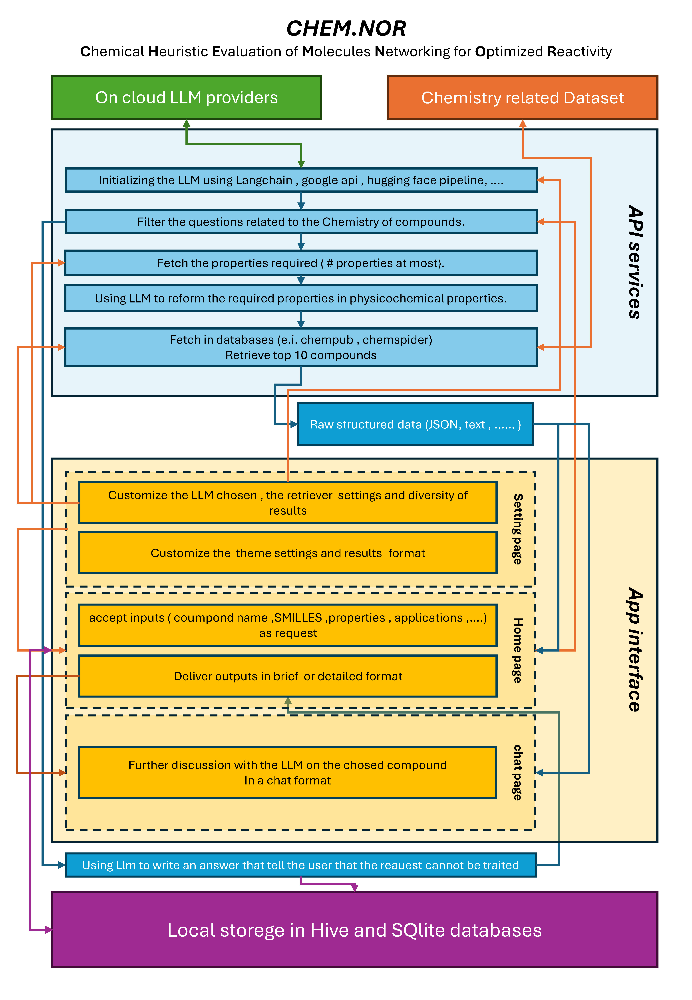

# ChemNOR: An AI-assisted chemistry toolkit for compound discovery, property analysis, and educational workflows

## Summary

ChemNOR is an open-source Dart package for chemistry-oriented discovery and analysis. The software integrates PubChem-backed compound retrieval and property lookup with AI-assisted reasoning to support exploratory compound identification from broad application descriptions, formula parsing, molecular-weight calculation, reaction balancing, spectroscopic simulation, and chemistry-focused conversational assistance. It is designed for students, educators, researchers, and developers who need a lightweight but integrated chemistry workflow without assembling multiple disconnected tools.

The package provides a practical software layer between user intent and chemical knowledge. Rather than replacing specialized cheminformatics engines, ChemNOR offers a workflow-oriented interface for rapid screening, annotation, and educational exploration. It is implemented as a modular, Dart-native library with clear responsibilities across chemistry-related functionality. This manuscript describes the software’s purpose, design rationale, position relative to existing tools, and its potential research and educational impact.

## Statement of need

Many chemistry workflows require users to combine several distinct capabilities: identifying candidate compounds, retrieving molecular properties, parsing formulas, balancing reactions, and interpreting structural or spectroscopic information[@Yousef2025]. These tasks are often distributed across multiple packages, websites, and APIs, each with its own interface and assumptions. This fragmentation is particularly burdensome for new users and for those working in exploratory settings rather than in a full computational chemistry environment.

ChemNOR addresses this gap by providing a single, integrated package that supports high-value chemistry tasks in one place. The project is motivated by the need for an accessible and extensible toolkit for compound discovery and interpretation in contexts where the user may not know the precise compound class in advance. A user can start from a broad description, material requirement, functional-group need, or synthetic target and quickly explore related chemical candidates and their properties.

The target audience includes chemistry students, educators, applied researchers, and software developers who need a lightweight but connected chemistry workflow. The package is especially relevant to early-stage research, teaching, and exploratory analysis, where usability, accessibility, and workflow continuity matter more than a full-featured computational chemistry environment. In this context, ChemNOR is not meant to replace mature cheminformatics frameworks; instead, it provides a practical interface between raw chemical information resources and task-oriented users.

## State of the field

The broader chemistry software ecosystem includes highly capable tools such as RDKit, Open Babel, PubChem data services, and specialized packages for structure generation, reaction modeling, and molecular property prediction[@Zhang2025]. These systems have made major contributions to cheminformatics and computational chemistry[@Ramos2025], and they support a much wider range of advanced scientific operations than ChemNOR. In that respect, ChemNOR is not positioned as a replacement for the core computational chemistry stack[@Yu2025].

Instead, ChemNOR occupies a complementary niche. It is centered on workflow accessibility and rapid discovery rather than on large-scale molecular modeling or deep structural chemistry operations. The package combines PubChem access with AI-generated structural motifs, allowing users to move from a natural-language or application-based description to plausible chemical patterns and compound-level properties. It also bundles related tasks such as formula parsing, reaction balancing, IUPAC naming, and spectroscopy utilities into a single environment. For many users, this combination is more approachable than assembling a custom pipeline from multiple tools and APIs.

The build-versus-contribute justification is therefore clear. ChemNOR is not intended to compete directly with established cheminformatics libraries in breadth or performance. Rather, it contributes a user-friendly, open-source workflow that lowers the barrier to chemistry exploration and supports educational and early-stage research use. In this sense, the software adds value by making common chemistry tasks more accessible, connected, and interpretable for a broader user base.

## Software design

ChemNOR follows a modular and pragmatic design philosophy as illustrated in Figure 1. Its public API is organized around logically separate responsibilities, including compound discovery, formula parsing, molecular-weight calculation, periodic-table access, spectroscopy utilities, reaction balancing, visualization, IUPAC naming, safety data retrieval, and chemistry-oriented conversational assistance. This separation keeps the codebase maintainable, readable, and extensible while also making the system usable without requiring expert knowledge of the underlying implementation.

A central design decision is the combination of two information sources: PubChem as a structured and well-established chemical database, and Google Gemini as an AI component for candidate generation and contextual reasoning. This hybrid approach reflects a realistic user workflow: the AI layer can suggest candidate functional groups or motifs from an application description, while the database layer provides concrete compound-level validation and property retrieval[@Kim2019]. The resulting design trades some strict determinism for a broader and more accessible exploratory workflow, which is especially useful in applied and educational contexts.

The library also emphasizes low-friction integration for Dart-based projects. The package exposes a compact and coherent set of modules and avoids unnecessary complexity in the public interface. This is an intentional trade-off: ChemNOR prioritizes usability, workflow continuity, and broad accessibility over deep computational chemistry sophistication. It is designed to be useful in real-world prototyping, teaching, and exploratory analysis, even when the exact chemical system is not yet known.

## Research impact statement

ChemNOR demonstrates credible near-term research and community value through its open-source structure, public documentation, and reusable software design. The package is distributed as a Dart library with repository metadata, issue tracking, and example-driven documentation that make the API accessible to users and contributors. It provides concrete usage patterns for compound discovery, formula parsing, spectroscopy support, and chemistry-focused AI assistance, which contribute to both reproducibility and adoptability.

The project’s likely impact is strongest in three areas. First, it reduces the effort needed to move from a vague application description to candidate chemical structures and associated properties. Second, it supports educational use by exposing common chemistry tasks in an approachable interface. Third, it demonstrates how AI-assisted chemistry reasoning can be embedded in an open-source software package alongside authoritative data retrieval. In this way, ChemNOR is not merely a collection of utilities; it is a research-enabling workflow for exploratory chemistry.

At present, the repository does not yet report formal external adoption statistics or peer-reviewed citation data, but its modular architecture, documentation quality, and public availability indicate strong near-term potential for adoption in teaching, prototyping, and early-stage chemistry analysis. These characteristics are important evidence of research significance for applied scientific software, especially when the software is meant to be used by a broader audience than specialized computational chemistry researchers.

## AI usage disclosure

No generative AI tools were used to create or verify the factual scientific content presented in this manuscript. The analysis, writing, and interpretation were performed directly by the authors based on the project’s public documentation and implementation. The claims in this paper are grounded in the software’s repository content, API design, and documented functionality rather than in model-generated output.

This disclosure is included to maintain transparency and reproducibility. If AI-assisted tools are used in future updates to the software or manuscript, those uses should be reported explicitly and checked against source code, documentation, and domain knowledge.

## Conclusion

ChemNOR contributes a practical and accessible chemistry software package that combines AI-assisted compound discovery with structured chemical-data retrieval and a broad set of chemistry utilities. Its value lies in integrating multiple routine tasks into a compact and approachable Dart library, making it suitable for education, early-stage research, and exploratory chemical analysis. While it does not replace larger and more specialized cheminformatics systems, it fills an important gap by providing an open, workflow-oriented tool that lowers the barrier to entry for users seeking to explore chemistry in a connected and reproducible way.

